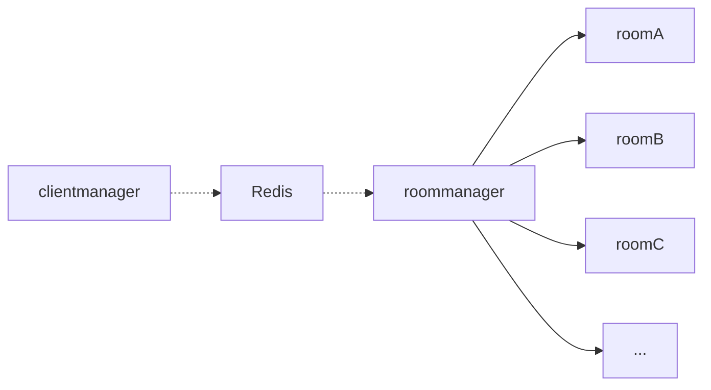

# Architecture

This document is a work in progress.

## Rooms

In order to accomodate horizontal scaling, there is a `clientmanager` and a `roommanager`. The `clientmanager` manages all websocket connections, and relays all messages for rooms via redis pubsub. The `roommanger` manages rooms, and takes care to ensure that it does not load a room that could be loaded on another node. Rooms manage their own state.

When a client joins a room, it subscribes to the events that the room emits. When the `clientmanager` receives a room event, it broadcasts the message to all of the clients that are subscribed to the room.

## Info Extractor

The Info Extractor refers to the process of extracting media metadata given a URL. Each video service has it's own "Service Adapter" to extract metadata. They live in `server/services`. All adapters must inherit from the `ServiceAdapter` class. The Info Extractor pipeline is invoked whenever the server is missing metadata for media. Additionally, the pipeline also handles caching of metadata.

Add Previews invoke the pipeline directly, as well as adding videos to the queue.
