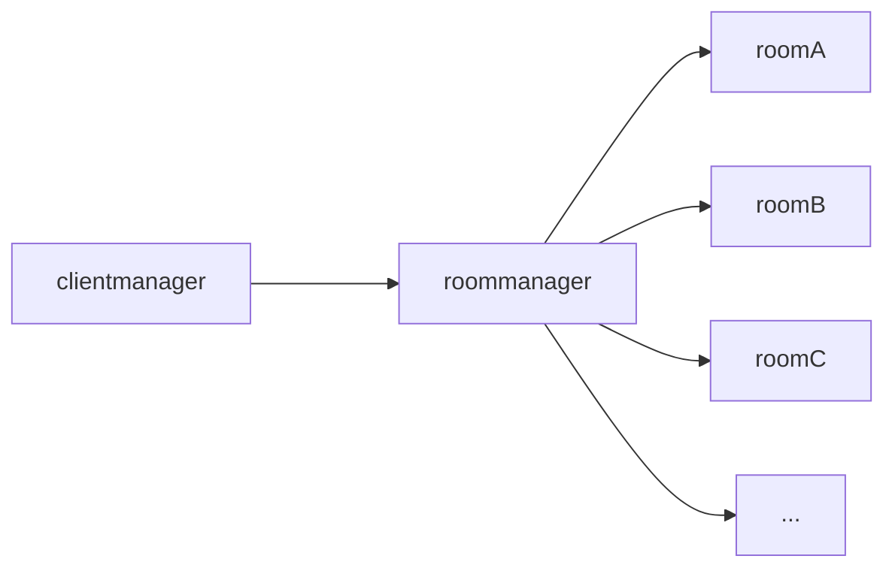
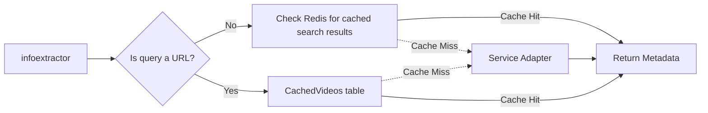

# Architecture

This document is a work in progress.

## Overview

There are 3 major components to the application:
- The Monolith (the server, written in Typescript, Node.js)
- The Client (the web client, written in Typescript, Vue 3)
- The Balancer (the load balancer, written in Rust, not currently deployed in production)

## Rooms

In order to accomodate horizontal scaling, there is a `clientmanager` and a `roommanager`. The `clientmanager` manages all websocket connections, and relays all messages for rooms to the `roommanager`. The `roommanger` manages rooms, and relies on the Balancer to ensure that the same room doesn't get loaded twice on different Monoliths. Rooms manage their own state.

When a client joins a room, it subscribes to the events that the room emits. When the `clientmanager` receives a room event, it broadcasts the message to all of the clients that are subscribed to the room.

## Info Extractor

The Info Extractor refers to the process of extracting media metadata given a URL. Each video service has it's own "Service Adapter" to extract metadata. They live in `server/services`. All adapters must inherit from the `ServiceAdapter` class. The Info Extractor pipeline is invoked whenever the server is missing metadata for media. Additionally, the pipeline also handles caching of metadata.

At a high level, the info extractor pipeline looks like this:

In reality, it's a bit more complicated.

Add Previews invoke the pipeline directly, as well as adding videos to the queue.

The ultimate goal for the info extractor is to collect as much useful metadata about one or more videos as possible from a variety of cached and remote sources, while minimizing remote requests. This generally includes, but is not limited to:

- title
- description
- thumbnail
- duration

### Caching

The pipeline caches metadata in two places: Redis and the database. Redis is used to cache search results, and the database is used to cache metadata for individual videos. At this time, no caching is done for playlists.

Video metadata is cached in the `CachedVideos` table. Search results are cached in Redis. The cache keys are the same as the query.

Cached videos are kept for 30 days. Search results are kept for 24 hours. After these periods, the cache is considered stale, and the pipeline will attempt to refresh the cache when the video is next requested. Direct videos are not cached.
